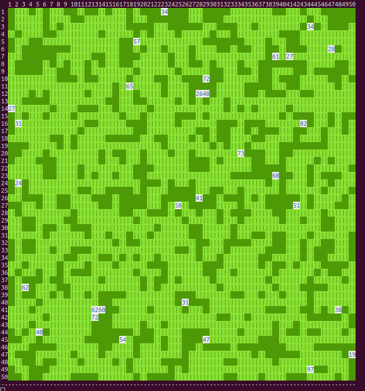
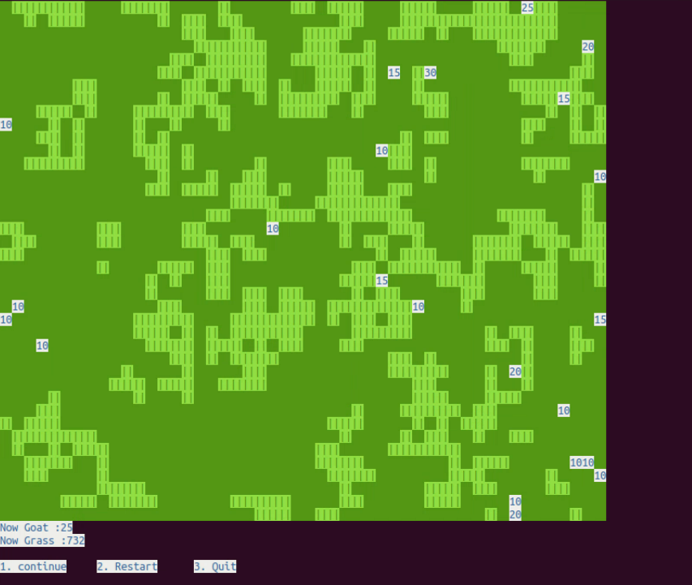

# Goat Grass Game    
  
## Introduction  
  
Every Goat eats Grass.  
  
They can have a goog afternoon.  
  
Sometimes we can add some evil animals.  
  
Let us see what happen on this place.  
  
## Now, You can start this game  
  
In this game, you can create creatures in this world.  
  
And you can enter these commands to control this game,  
  
1: Continue this game  
  
2: Restart this game   
  
3: Quit this game 
  
Finally, you can observe What happen in this world.  
  
And tell me how many creatures in this world,  
  
It must be so fun.  
  
## All interfaces of Game  
  
The lastest Commit  
(no add CommandIO)  
  
  
  
  
Now, this is the new commit   
(add CommandIO, can enter Command in any time)  

  
  
  
  
  
  

## Author in this game  
吳昀倫(Code Maker)  

